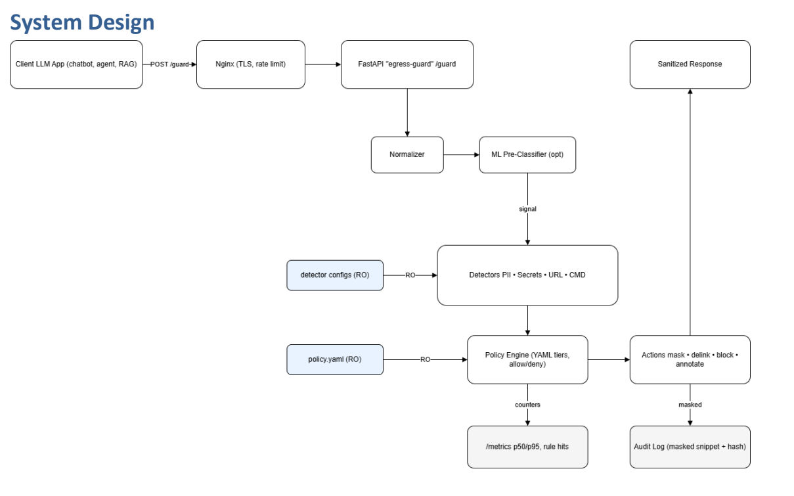
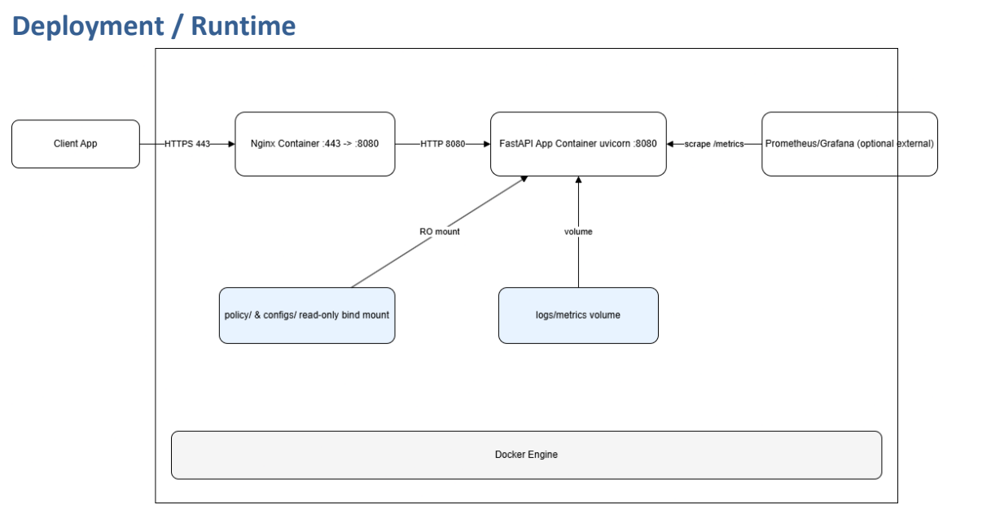
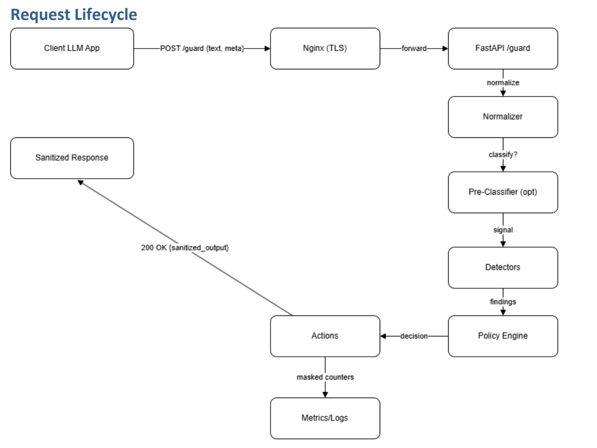

## LLM Egress Guard — Capstone Project Essay

**Author:** Baran Akin  
**Course:** PW25 – DSC03 Capstone Project  
**Term:** SoSe 2025/26  
**Supervisors -**  
Dr. Humera Noor Minhas  
Prof. Ebby George Varghese  
**Date:** 2026-01-13  
**Repository:** `llm-egress-guard` (GitHub: `https://github.com/brnakin/llm-egress-guard`)  
**License:** MIT  

---

## ABSTRACT

Large Language Models (LLMs) have introduced a new security boundary for modern applications: the model’s **output** frequently becomes an operational artifact that is forwarded, pasted, stored, executed, or acted upon. In practice, this “response text” can carry sensitive data (personal information, credentials, proprietary content) or generate harmful instructions (malicious commands, unsafe automation steps, exploitation guidance). While organizations often invest heavily in upstream controls—prompt hardening, retrieval restrictions, or alignment techniques—those measures remain probabilistic, incomplete, and difficult to audit. This capstone project, **LLM Egress Guard**, addresses the last-mile problem by implementing a deterministic, policy-driven layer that scans LLM outputs immediately before they leave a trust boundary.

LLM Egress Guard is built as a FastAPI service providing a synchronous `/guard` endpoint. The service enforces a fixed pipeline—**normalize → parse → detect → decide → act → observe**—that is explicitly designed for security resilience. Normalization counters encoding and obfuscation attacks by applying bounded URL decoding, bounded HTML entity decoding, Unicode NFKC normalization, and removal of control and zero-width characters (The Unicode Consortium, n.d.). Parsing segments content into text, code, and link contexts to reduce false positives while retaining auditable evidence. Detection is performed by a suite of deterministic detectors (PII, secrets, URL risk, command chains, and exfiltration blobs), each producing structured findings with stable rule identifiers. A configurable YAML policy engine converts findings into risk scores, block/mask/delink actions, and user-facing safe messages. The system is instrumented with Prometheus metrics and designed for production-like observability via Grafana dashboards, with additional artifacts such as a weekly metrics export report (Prometheus Authors, n.d.; Grafana Labs, n.d.).

Evaluation emphasizes repeatable behavior. Unit tests validate normalization safety, parser segmentation, detector correctness, and API behavior; a regression corpus with “golden” expected outputs prevents drift over time. The project also includes an optional ML pre-classifier (integrity-verified) used primarily for context classification, operated in safe “shadow mode” to avoid introducing probabilistic enforcement into a deterministic guardrail. The capstone concludes that egress guarding is a practical, measurable, and audit-friendly security control, and it identifies future work including streaming support, CI workflow wiring, dependency hygiene for optional ML, and SIEM event emission.

**Keywords:** LLM security, egress control, deterministic DLP, output filtering, normalization, policy engine, observability, Prometheus, Grafana, prompt injection.

---

## Table of Contents

- [ABSTRACT](#abstract)
- [1. Introduction & Problem Motivation](#1-introduction--problem-motivation)
  - [1.1 Why Egress Guarding Is a Distinct Security Layer](#11-why-egress-guarding-is-a-distinct-security-layer)
  - [1.2 What This Repository Builds (and What It Intentionally Does Not)](#12-what-this-repository-builds-and-what-it-intentionally-does-not)
  - [1.3 Project Objectives](#13-project-objectives)
  - [1.4 How to Read This Essay](#14-how-to-read-this-essay)
- [2. Problem Statement](#2-problem-statement)
  - [2.1 Threat Model and Trust Boundaries](#21-threat-model-and-trust-boundaries)
  - [2.2 Functional Requirements and Non-Requirements](#22-functional-requirements-and-non-requirements)
  - [2.3 Success Criteria and Evaluation Philosophy](#23-success-criteria-and-evaluation-philosophy)
- [3. Background & Literature Review](#3-background--literature-review)
  - [3.1 Deterministic DLP vs. LLM-Based Moderation](#31-deterministic-dlp-vs-llm-based-moderation)
  - [3.2 Normalization, Encoding Attacks, and Defensive Parsing](#32-normalization-encoding-attacks-and-defensive-parsing)
  - [3.3 OWASP-Oriented Controls for Guardrails](#33-owasp-oriented-controls-for-guardrails)
  - [3.4 Observability as a Security Primitive](#34-observability-as-a-security-primitive)
- [4. Data (Dataset Description)](#4-data-dataset-description)
  - [4.1 Regression Corpus as Ground Truth for Guard Behavior](#41-regression-corpus-as-ground-truth-for-guard-behavior)
  - [4.2 Synthetic Secret Placeholders](#42-synthetic-secret-placeholders)
  - [4.3 ML Training Data for the Optional Pre-Classifier](#43-ml-training-data-for-the-optional-pre-classifier)
- [5. Methodology (Model and Analysis)](#5-methodology-model-and-analysis)
  - [5.1 System Architecture and Deployment Modes](#51-system-architecture-and-deployment-modes)
  - [5.2 API Contract, Schemas, and Input Handling](#52-api-contract-schemas-and-input-handling)
  - [5.3 Pipeline Walkthrough: Normalize → Parse → Detect → Decide → Act](#53-pipeline-walkthrough-normalize--parse--detect--decide--act)
  - [5.4 Normalization Layer: Security Properties and Bounds](#54-normalization-layer-security-properties-and-bounds)
  - [5.5 Parsing, Context, and Explain-Only Classification](#55-parsing-context-and-explain-only-classification)
  - [5.6 Detector Suite: PII, Secrets, URLs, Commands, Exfil](#56-detector-suite-pii-secrets-urls-commands-exfil)
  - [5.7 Policy Engine: Risk Scoring and Decision Controls](#57-policy-engine-risk-scoring-and-decision-controls)
  - [5.8 Action Engine: Masking, Delinking, Blocking, and Safe Messages](#58-action-engine-masking-delinking-blocking-and-safe-messages)
  - [5.9 Optional ML Components and Security Hardening](#59-optional-ml-components-and-security-hardening)
  - [5.10 Observability and Testing Methodology](#510-observability-and-testing-methodology)
  - [5.11 Security Hardening at the API and Proxy Layers](#511-security-hardening-at-the-api-and-proxy-layers)
  - [5.12 SIEM Integration Capability (Deferred Wiring)](#512-siem-integration-capability-deferred-wiring)
  - [5.13 Packaging and Dependency Management](#513-packaging-and-dependency-management)
- [6. Results and Recommendations](#6-results-and-recommendations)
  - [6.1 Implementation Outcomes by Sprint](#61-implementation-outcomes-by-sprint)
  - [6.2 Quality Results (Unit + Regression + Matrix Artifacts)](#62-quality-results-unit--regression--matrix-artifacts)
  - [6.3 Performance Results and Operational Metrics](#63-performance-results-and-operational-metrics)
  - [6.4 Security Posture and Remediation Summary](#64-security-posture-and-remediation-summary)
  - [6.5 Limitations and Known Gaps](#65-limitations-and-known-gaps)
  - [6.6 Recommendations and Future Work](#66-recommendations-and-future-work)
  - [6.7 Repository Coverage Checklist (Key Artifacts)](#67-repository-coverage-checklist-key-artifacts)
- [7. Conclusions](#7-conclusions)
- [8. Acknowledgements](#8-acknowledgements)
- [Appendix A: Capstone Proposal (Included as Project Artifact)](#appendix-a-capstone-proposal-included-as-project-artifact)
- [Appendix B: Proposal-to-Final Traceability Matrix](#appendix-b-proposal-to-final-traceability-matrix)
- [Appendix C: Proposal Graphs / Figures (Paste-Into-Word Placeholders)](#appendix-c-proposal-graphs--figures-paste-into-word-placeholders)
- [9. References](#9-references)

---

## 1. Introduction & Problem Motivation

LLM-based systems are increasingly deployed as user-facing assistants, internal copilots, and automation agents. In these roles, LLMs do not merely “generate text”; they generate instructions, decisions, summaries, and outputs that can be copied into terminals, embedded into tickets, sent to customers, or stored in logs. This shift turns the model’s output into a **security-relevant egress channel**. The organization may trust its internal environment, identity controls, and document storage, yet the output layer can still accidentally transmit sensitive information, or it can provide harmful instructions that enable compromise if followed.

In a typical deployment, an LLM application sits upstream of several components: prompt templates, retrieval systems, user input, and policy constraints. Each of these components can fail. A retrieval system can return a confidential document. A user can attempt prompt injection. A model can hallucinate convincing credentials. An agent can produce command chains that are operationally risky even when technically accurate. The security lesson is not that upstream controls are useless—they are necessary—but that they are incomplete. A robust system needs a final deterministic gate that is auditable, measurable, and tunable.

**LLM Egress Guard** is designed as that final gate: a deterministic “last-mile” layer that sits immediately before the trust boundary crossing. Its role is not to “judge intent” with probabilistic moderation, but to apply bounded normalization, rule-based detections, and policy-driven actions that prevent common leakage and harm patterns. The project is implemented as a working service with configuration, tests, documentation, and operational observability, reflecting an engineering approach suitable for real-world security tooling.

To understand why this matters, consider a few representative scenarios that are already common in modern organizations:

- A support bot is asked to “help debug a deployment,” and it responds by pasting a log excerpt that includes an access token. Even if that token is short-lived, it may be enough for immediate abuse, and the leak may persist in tickets and chat history.
- An internal copilot is asked “How do I fix this server error?” and it outputs a command chain that is technically correct but operationally dangerous if run in the wrong environment (e.g., destructive filesystem operations, disabling security controls, or piping scripts directly into a shell).
- A customer-facing assistant is prompted with a crafted injection that causes it to embed a risky URL with credentials in the link, or to hide payloads using encoding and invisible characters that defeat naïve pattern matching.

These are not exotic threats. They sit at the intersection of classic data leakage risk and modern AI-enabled workflows. The output boundary is therefore a security control point that benefits from deterministic enforcement and measurable governance.

### 1.1 Why Egress Guarding Is a Distinct Security Layer

Security architecture often distinguishes between **prevention** controls and **detection/response** controls. Egress guarding belongs to prevention, but it is a special case: it is not about preventing unauthorized access to data at rest; it is about preventing unsafe content from leaving a protected environment in the first place. In traditional enterprise security, DLP systems scan outbound email, file uploads, and web traffic. LLM outputs add a new outbound channel that is often treated as “just text,” and therefore escapes DLP scrutiny.

Egress guarding is distinct for several reasons:

- LLM outputs can combine multiple risk types in a single response (e.g., “Here is a debug log with a token” plus “Run this command to fix it” plus “Click this link”). A guard must handle composite risk, not a single-label classification.
- LLM outputs are frequently formatted as Markdown, with code fences and links. A guard that ignores structure risks false positives (blocking harmless tutorials) or false negatives (missing payloads hidden behind formatting).
- Attackers can obfuscate content via encoding layers (URL encoding, HTML entities), Unicode tricks, and invisible characters. A guard that does not normalize can be bypassed.
- Guardrails must be auditable. If an output is blocked, engineers and compliance teams need stable rule identifiers, severity, and a reason.

By implementing a deterministic scanning and policy layer, LLM Egress Guard aims to provide predictable outcomes that can be tuned per environment and validated via a regression corpus.

### 1.2 What This Repository Builds (and What It Intentionally Does Not)

This capstone delivers a functioning service, not a prototype document. The repository includes:

- A FastAPI service with a synchronous `/guard` endpoint and supporting `/healthz` and `/metrics` endpoints.
- A hardened normalization module designed to defeat common obfuscation and encoding bypasses while remaining bounded to avoid resource exhaustion.
- A parser that segments outputs into code, text, and link contexts and implements an “explain-only” heuristic to reduce false positives for educational material.
- A detector suite for PII patterns, secret formats, risky URLs, command chains, and exfiltration blobs (large base64 or hex sequences).
- A YAML-configured policy engine that translates findings into risk scores and actions (mask, delink, block), including allowlist mechanisms and context-based adjustments.
- An action engine that applies transformations and returns localized safe messages.
- Observability integration with Prometheus metrics, a Grafana dashboard, and a weekly report exporter that converts metrics into a governance artifact.
- Tests that cover unit behavior and a regression corpus with golden expectations to prevent behavioral drift.
- Optional ML components (a lightweight pre-classifier and a spaCy-based validator) gated by feature flags and designed to fail safely.

The project also explicitly does not implement certain features:

- Streaming output guarding is not part of the MVP. Streaming requires incremental scanning, buffering, and careful release policies; it is documented as future work.
- CI wiring and enforcement evolves with the repo: the current implementation uses a GitHub Actions workflow under `.github/workflows/ci.yml`, while legacy references to `ci/github-actions.yml` may exist in older documents.
- SIEM connectors exist as modules, but in-pipeline SIEM emission is not wired into the main request path yet, preserving MVP simplicity.

### 1.3 Project Objectives

This project’s objectives are aligned with practical security controls rather than purely academic model performance:

- Build a deterministic egress guard that detects and mitigates common LLM output risks: PII, secrets, risky URLs, command chains, and encoded exfiltration blobs.
- Apply normalization that defeats obfuscation techniques while enforcing strict bounds to avoid expansion bombs and DoS.
- Reduce false positives using context (code blocks, links) and “explain-only” heuristics, without enabling easy bypass of high-severity blocks.
- Implement a configurable policy engine so organizations can tune actions and risk weighting without changing detector code.
- Provide observability to support monitoring, tuning, and incident response, with metrics that reflect both security and performance signals.
- Ensure repeatable, contract-like behavior using unit tests and a regression corpus with golden expected outputs.

In addition to the objectives above, the capstone includes explicit constraints that shape the engineering approach:

- The system must be deterministic by default. Optional ML may assist classification, but enforcement must remain explainable and stable.
- The guard must be safe to operate as a public-facing or semi-public service. This implies strict request limits, timeouts, concurrency controls, and safe logging.
- The guard must be configurable without code changes, because security policy tuning is an operational process that must evolve as threats and organizational tolerance evolve.
- The guard must avoid becoming a new data leak vector. A common failure mode in security tooling is that it “detects secrets” but then logs or returns those secrets in full; this project explicitly prevents that through masking and snippet hashing practices.

### 1.4 How to Read This Essay

Section 2 formalizes the problem statement, threat model, requirements, and evaluation criteria. Section 3 situates the work in relevant security practice (deterministic DLP, normalization and parsing, OWASP-aligned controls, and observability). Section 4 describes the datasets used for evaluation and optional ML training. Section 5 explains the system’s methodology, architecture, and implementation approach. Section 6 summarizes results, limitations, and recommendations. Sections 7–9 provide conclusions, acknowledgements, and references.

---

## 2. Problem Statement

LLM-generated responses can leak sensitive information or provide operationally dangerous instructions. In enterprise settings, those outputs often cross trust boundaries—from internal systems to external users, customer channels, or downstream automation tools—without the same inspection applied to traditional egress channels. The problem addressed by this capstone is the lack of a deterministic, auditable, and policy-controlled mechanism to scan and transform LLM outputs before they leave a protected environment.

### 2.1 Threat Model and Trust Boundaries

The central trust boundary can be expressed as:

Upstream LLM + retrieval + user inputs → LLM response → (Egress Guard) → external recipient / downstream tool

The egress guard must assume upstream components are fallible or adversarially influenced:

- **Prompt injection and coercion**: Users can attempt to override system instructions and induce the model to reveal sensitive data.
- **Retrieval leakage**: Retrieval-augmented generation may incorporate confidential documents or internal identifiers into responses.
- **Credential and token leakage**: Logs, error traces, or configuration snippets can contain keys and tokens; models may reproduce them.
- **Operational harm**: Models may generate command chains that are dangerous if executed, especially when presented as “fix steps.”
- **Malicious links**: Shorteners, credential-in-URL patterns, data URIs, and suspicious extensions increase click risk.
- **Encoding obfuscation**: URL encoding, HTML entity encoding, Unicode tricks, and zero-width characters can hide payloads.
- **Denial of service pressure**: Guard systems are attractive targets; large payloads and pathological inputs can stress normalization and regex scanning.

The guard must follow fail-safe defaults: if the system cannot confidently process or evaluate content within bounds, it should prefer safe degradation (block or safe message) over silent leakage.

Another important aspect of the threat model is that the guard itself must be resilient to adversarial inputs that are crafted to cause bypass or to consume disproportionate resources. An attacker does not need to “break” the LLM to cause harm; they can target the guard by:

- Providing extremely large inputs (or inducing extremely large LLM outputs) to trigger worst-case regex and decoding behavior.
- Layering encodings (URL + HTML entities + Unicode tricks) to cause repeated expansion unless decoding is bounded.
- Attempting to exploit “educational context” heuristics to reduce risk scores while still delivering actionable payloads.

Therefore, the guard must implement defense-in-depth at both content-processing and service layers.

### 2.2 Functional Requirements and Non-Requirements

Functional requirements for the MVP include:

- Deterministic scanning across multiple risk categories:
  - PII: email, phone, IBAN, national identifiers, payment cards, IP literals.
  - Secrets: JWTs, cloud keys, service credentials, PEM private keys, high-entropy tokens.
  - URLs: data URIs, shorteners, suspicious TLDs, credentials in URL, IP-literal URLs, executable/archive extensions.
  - Commands: shell and PowerShell patterns, dangerous chains (e.g., `curl | bash`, encoded PowerShell).
  - Exfil patterns: large base64 and hex blobs consistent with copy/paste data transfer.
- Policy-driven decisions using a configurable YAML policy file:
  - Risk weights, severities, and actions per rule.
  - Allowlist mechanisms (exact, regex, per-tenant).
  - Context adjustments for code blocks, educational context, and link contexts.
- Action application:
  - Mask sensitive spans, delink URLs to reduce clickability, block entire responses with safe messages when necessary.
- Observability:
  - Metrics for latency, rule hits, block rates, context distribution, and ML status when enabled.
- Testability and stability:
  - Unit tests for core modules and an end-to-end regression suite with golden expectations.

Non-requirements (explicitly out of scope for this capstone snapshot) include:

- Streaming token-by-token guarding.
- LLM-as-a-judge semantic moderation as the primary enforcement mechanism.
- Deep intent inference beyond lightweight context classification.
- Full production SIEM emission wired into the request path (connectors exist but integration is deferred).

### 2.3 Success Criteria and Evaluation Philosophy

Success criteria prioritize deterministic correctness and operational usefulness:

- The guard consistently blocks or neutralizes sensitive/dangerous content when policy dictates.
- Behavior remains stable as the code evolves, enforced by a regression corpus with golden expected outputs.
- Performance remains suitable for synchronous request paths; time-bounded normalization and short-circuit evaluation reduce cost.
- Security posture reflects defensive engineering: authentication gating, request limits, timeouts, safe model loading practices, and robust logging/metrics.

This evaluation philosophy treats guard behavior as a contract. In security tooling, predictable, auditable behavior is often more valuable than a high but unstable “accuracy” metric.

In practical terms, this capstone evaluates the system on:

- **Behavioral stability**: Do rule IDs and block decisions remain stable across code changes? If they change, are changes intentional and reviewed?
- **Audit readiness**: Can a stakeholder explain *why* a response was blocked, *which rule fired*, and *what action was applied* without inspecting raw sensitive content?
- **Operational fitness**: Can the system run behind an edge proxy with rate limiting, expose metrics for monitoring, and maintain low latency under normal conditions?
- **Security posture**: Does the guard avoid common pitfalls such as leaking secrets in logs, unsafe model loading, or allowing easy policy downgrades?

---

## 3. Background & Literature Review

This capstone draws on established security concepts—DLP, secure parsing, OWASP controls, and observability—then adapts them to the LLM output domain. While the project itself is implemented using application code and configuration artifacts, the motivating principles align with widely used security frameworks and best practices.

### 3.1 Deterministic DLP vs. LLM-Based Moderation

Classic DLP systems scan egress channels for patterns such as PII formats, secrets, and document fingerprints. Their strengths are determinism, auditability, and policy control: the same input yields the same decision, and the organization can explain why a block occurred.

In contrast, LLM-based moderation systems can be inconsistent and difficult to audit because the model’s decisions are probabilistic. While such systems can be useful for nuanced content classification, they complicate governance when outputs must meet strict compliance requirements. LLM Egress Guard intentionally mirrors the DLP philosophy: rule-based detections and explicit policy. Optional ML components are included only as bounded, best-effort helpers for context classification and validation, not as the primary enforcement mechanism.

This design choice reflects a practical constraint: for many organizations, the acceptable risk posture for sensitive outputs is not “probably safe,” but “provably consistent under policy.”

It is also worth noting that determinism does not mean rigidity. In classic DLP operations, security teams continuously tune rules, weights, exceptions, and allowlists based on observed false positives and evolving threat intelligence. LLM Egress Guard adopts that operational model: detectors provide stable evidence, while policy defines how that evidence is interpreted and acted upon.

For example, an enterprise might decide that certain URL patterns should be “delinked” rather than blocked for internal-facing assistants, while customer-facing assistants may require strict blocking for the same patterns. A deterministic, policy-driven approach makes these posture shifts explicit and testable.

### 3.2 Normalization, Encoding Attacks, and Defensive Parsing

Normalization is a core theme in secure input handling. Filters and detectors fail when inputs can be represented in multiple equivalent forms. Attackers exploit this by hiding payloads behind encoding layers or Unicode tricks. Defensive normalization seeks to transform inputs into a canonical form before detection.

However, normalization itself can create risk: repeated decoding can cause exponential expansion (“expansion bombs”), and uncontrolled normalization can become a DoS vector. Therefore, a security-focused normalization strategy must include explicit bounds: maximum decode passes, maximum entity counts, maximum output size, and time budgets. LLM Egress Guard implements normalization with precisely these bounds, recognizing that “make it canonical” and “make it safe to process” must be addressed together.

Defensive parsing addresses a different but related issue: context. LLM outputs often contain Markdown with code blocks. Commands inside code fences can be part of harmless educational content. A naive command detector will produce false positives, undermining adoption. Context-aware parsing segments text into meaningful regions and attaches context metadata to findings, enabling policy to adjust risk and actions.

This project’s parsing strategy is intentionally “explain-only,” meaning it provides context annotations rather than executing or interpreting code. This reduces complexity and risk. The goal is not to “understand” a program; it is to understand whether a suspicious pattern appears in a context that is likely instructional. In practice, organizations often want both: prevent the worst outcomes while keeping assistants useful for education and debugging. That tension is managed through policy controls rather than hidden logic.

### 3.3 OWASP-Oriented Controls for Guardrails

An egress guard is itself a security-critical component. If it can be bypassed, abused, or exhausted, it becomes a liability. OWASP-oriented guidance motivates multiple hardening measures:

- **Authentication and authorization controls** (e.g., an API key gate) to restrict access to the guard or to sensitive endpoints like metrics.
- **Resource limits** to prevent large payload attacks: request size limits, timeouts, concurrency bounds.
- **Secure handling of untrusted artifacts** such as ML models, which may rely on deserialization; integrity checks and trusted-path enforcement reduce supply-chain risk.
- **Logging and monitoring** to support incident response and detect anomalies such as spikes in block rates or timeouts.

The project includes an explicit security assessment document and implements remediations that map to these classes of controls.

In many capstones, security hardening is treated as optional. In this project, it is treated as core scope because egress guards are attractive targets and sit on a trust boundary. The work aligns especially well with OWASP themes around:

- **Security logging and monitoring**: a guard must instrument outcomes and anomalies.
- **Identification and authentication**: access to guard endpoints can be gated to prevent abuse.
- **Vulnerable and outdated components / supply chain**: model artifacts and dependencies require integrity and versioning discipline.
- **Software and data integrity failures**: loading serialized models without integrity checks is a known risk; this project mitigates it with manifest verification.
(OWASP Foundation, 2021).

### 3.4 Observability as a Security Primitive

Observability is often framed as an operations concern, but for guardrails it is also a security necessity. A guard that blocks content without metrics creates blind spots: leadership cannot distinguish between legitimate improvements (more leaks prevented) and a misconfiguration causing over-blocking. Similarly, latency spikes may indicate a DoS attempt or a pathological input class. By instrumenting detector latencies, rule hits, and context distribution, the system enables both performance tuning and security analysis.

This project’s observability design uses Prometheus and Grafana to provide immediate dashboards, and it adds a weekly export script to generate a narrative report for governance (Prometheus Authors, n.d.; Grafana Labs, n.d.). This approach recognizes that security stakeholders often want not only dashboards, but also periodic, shareable artifacts.

Another benefit of observability is that it supports controlled rollout and policy tuning. When organizations deploy a guard, they often start in “monitor mode” (detect and log) before moving to “enforce mode” (block). Even though LLM Egress Guard is not explicitly designed as a two-mode system, its metrics and detailed findings enable a similar operational practice: teams can observe rule hit rates and false positives, then adjust policy weights and actions to reach an acceptable balance.

---

## 4. Data (Dataset Description)

Unlike many machine learning capstone projects, the primary “data” for LLM Egress Guard is not a labeled training corpus for a large model, but a set of deterministic test and evaluation assets. The project treats guard behavior as a specification, enforced through curated examples and golden expectations. Optional ML components are trained on synthetic data to classify context categories, but the core system remains rule-based.

### 4.1 Regression Corpus as Ground Truth for Guard Behavior

The central dataset is the regression corpus under `tests/regression/corpus_v1/`. It is organized by category:

- `clean/`: safe outputs that should pass without blocking.
- `pii/`: outputs containing emails, phones, IBANs, national identifiers, payment cards, and IP addresses.
- `secrets/`: outputs containing synthetic tokens that match secret detectors (JWTs, cloud keys, PEM blocks).
- `url/`: outputs containing risky URL patterns (data URIs, shorteners, suspicious TLDs, credential-in-URL).
- `cmd/`: outputs containing dangerous command patterns (e.g., `curl | bash`, PowerShell encoded commands, destructive shell patterns).
- `exfil/`: outputs containing large base64 or hex blobs consistent with copy/paste exfiltration.

This corpus functions as a practical approximation of what an organization might see in LLM outputs: debug snippets, how-to instructions, code examples, and malicious or risky content. Crucially, the regression suite pairs each sample with a golden expectation file (`tests/regression/golden_v1.jsonl`) and a manifest describing versioning. The runner compares current behavior to the golden record and fails when behavior drifts. This turns egress guard behavior into a stable contract, similar to how security teams maintain rule packs and expected outcomes in traditional DLP.

The manifest-based approach is particularly important for capstone evaluation because it provides a simple, auditable “dataset contract.” In the repository snapshot used for this essay, the regression corpus is organized into a versioned collection (e.g., `v1.x`), and the golden manifest includes metadata such as sample counts, generation date, and version tag. This makes it possible to reference not only “tests pass,” but “tests pass against a known corpus version,” which is a stronger statement for reproducibility.

The regression runner supports workflows beyond pass/fail:

- Updating golden outputs intentionally when policy changes are desired.
- Generating detector matrix artifacts that summarize how each detector behaves across curated scenarios.
- Applying placeholders consistently so that secret patterns remain realistic without committing raw secrets.

This methodology is similar to how security teams validate rule changes before deployment: run a curated set of cases, confirm that changes are intended, then promote the rule pack.

### 4.2 Synthetic Secret Placeholders

Realistic secret scanning is difficult because storing actual secrets in a repository is unsafe and often blocked by platform “push protection.” To solve this, LLM Egress Guard uses placeholder markers inside regression samples (for example, `{{AWS_ACCESS_KEY}}` or `{{JWT_SAMPLE_TOKEN}}`). At runtime, the regression runner expands these placeholders into deterministic synthetic tokens that match detector patterns. This design has multiple benefits:

- It prevents accidental leakage of real credentials in source control.
- It maintains realistic detector coverage because tokens match real-world regex signatures.
- It keeps tests deterministic: the same placeholder expands to the same token, avoiding flaky baselines.
- It makes it easier to add new categories of secrets without changing corpus files to include raw tokens.

In other words, the project treats “secret hygiene” as part of the testing methodology and aligns it with modern secure development workflows.

This placeholder technique also reduces a common compliance concern: that security tooling might inadvertently “train” developers to expose secrets by normalizing them into test artifacts. By keeping secrets synthetic and derived, the project maintains realism while preserving safe development practices.

### 4.3 ML Training Data for the Optional Pre-Classifier

The project includes optional ML components, especially a pre-classifier that predicts whether a segment is likely educational, command-like, or normal text. The training data for this component is stored under `data/ml_training/` and is generated from prompts in `prompts/ml_training/`. The training workflow uses JSONL data splits into training and evaluation sets. The dataset is designed to represent common LLM output styles:

- Educational security tutorials with warnings and “do not run” language.
- Malicious or actionable command outputs.
- Clean explanatory text without operational risk.
- Multilingual content and edge cases where warnings are subtle.

The ML component is intentionally lightweight, using classic feature extraction (e.g., TF-IDF) and a simple classifier to keep inference fast and interpretable. Importantly, ML is feature-gated and designed to fail safely: the deterministic pipeline remains primary, and ML can operate in shadow mode to measure disagreements without altering enforcement.

The ML dataset is designed around three classes that map directly to operational needs:

- **educational**: the content includes commands, but the surrounding framing suggests tutorial or warning context.
- **command**: the content is actionable and operationally risky, with little to no safety framing.
- **text**: normal safe content without command or leakage risk indicators.

This classification supports the parsing and explain-only methodology without attempting to solve the broader and more ambiguous problem of “harmfulness” in general. It is intentionally scoped to the guard’s needs and can be evaluated continuously via shadow-mode disagreement metrics.

---

## 5. Methodology (Model and Analysis)

The methodology of LLM Egress Guard is the engineering approach used to build, enforce, and validate the output scanning system. It combines deterministic detectors, a policy engine, bounded normalization, context-aware parsing, and observability. While the word “model” often implies machine learning, here it refers to the overall system model: the architecture of components and their interaction in the guard pipeline.

### 5.1 System Architecture and Deployment Modes

The system is implemented as a FastAPI service. It supports two primary operational modes:

- Local development mode, where developers run the application directly with Uvicorn.
- A production-like container stack with Nginx acting as an edge proxy (TLS termination and rate limiting), Prometheus scraping metrics, and Grafana visualizing dashboards.

The deployment model emphasizes a realistic security posture: the guard is not only a Python library but a perimeter-like service with an explicit API boundary, consistent with how organizations deploy DLP gateways.

In the full stack deployment, the components play complementary roles:

- **Nginx** provides TLS termination, rate limiting, and endpoint-level restrictions (notably for `/metrics`).
- **FastAPI** implements the business logic: normalization, parsing, detection, policy evaluation, actions, and response shaping.
- **Prometheus** scrapes metrics from the app endpoint and stores time-series data.
- **Grafana** visualizes metrics and supports security/ops dashboards.

This architecture is intentionally modular. In production, organizations may choose a different proxy, a managed metrics stack, or a different dashboarding tool. The capstone demonstrates the principle: guardrails are most useful when they are observable and enforceable at a boundary that is easy to deploy.

**Figure 1 (System Design):** The diagram below matches the implemented pipeline and major components.

Table 1 summarizes core modules and their responsibilities.

| Component / Module | Responsibility | Key Artifact(s) |
|---|---|---|
| FastAPI app | Request handling, pipeline orchestration, response shaping | `app/main.py`, `app/pipeline.py` |
| Normalization | Canonicalization + anti-bypass bounds | `app/normalize.py`, `NORMALIZATION_SECURITY.md` |
| Parsing | Segment outputs (text/code/link), explain-only classification | `app/parser.py` |
| Detectors | Rule-driven scans for risk categories | `app/detectors/*` |
| Policy engine | Risk scoring, action selection, allowlists | `app/policy.py`, `config/policy.yaml` |
| Actions | Apply mask/delink/block + safe messages | `app/actions.py`, `config/locales/en/safe_messages.yaml` |
| Metrics | Prometheus metrics emission | `app/metrics.py` |
| Regression suite | Golden tests + corpus | `tests/regression/*` |
| Proxy/observability | Edge controls + dashboards | `nginx/nginx.conf`, `grafana/*`, `prometheus/*` |

**Figure 2 (Deployment / Runtime):** The diagram below matches the docker-compose + Nginx runtime layout used in this project.

### 5.2 API Contract, Schemas, and Input Handling

The primary endpoint is `POST /guard`, which accepts an LLM response string (plus optional metadata and policy identifiers) and returns:

- A sanitized response (potentially masked or delinked, or replaced entirely if blocked).
- A list of structured findings with stable rule identifiers, severities, spans, and details.
- A blocked flag and a numeric risk score for governance and tuning.
- Latency metadata and version information for traceability.

The methodology treats API design as a security feature. A guard that returns only “blocked: true” is hard to tune; one that returns structured findings enables audit, debugging, and policy improvement without storing raw sensitive content.

The API contract is also a governance mechanism. By returning a `policy_id`, a `risk_score`, and a structured list of findings, the guard enables:

- Centralized auditing (“Which rules are driving blocks this week?”).
- Policy experimentation (“What happens if we change the risk weight of a URL shortener rule?”).
- Tenant-specific posture (“Which customers require strict blocking vs masking?”).

Even when an organization chooses not to expose findings externally, the internal record of findings can be emitted into logs or SIEM systems as structured events (with secrets redacted), enabling later investigation and policy refinement.

### 5.3 Pipeline Walkthrough: Normalize → Parse → Detect → Decide → Act

The core methodology is the pipeline:

- **Normalize**: Convert the input into a canonical form, removing obfuscations and decoding bounded encodings.
- **Parse**: Segment the normalized text into context regions (text, code, link) and annotate segments with “explain-only” metadata when educational context is detected.
- **Detect**: Run deterministic detectors over the content, producing findings with rule IDs and spans.
- **Decide**: Evaluate a YAML policy to compute risk scores and determine actions (mask, delink, block).
- **Act**: Apply transformations to the output in a stable order; if blocked, return a safe message.
- **Observe**: Emit metrics and structured logs to support monitoring, tuning, and incident response.

**Figure 3 (Request Lifecycle):** The diagram below matches the request flow from client → proxy → `/guard` → pipeline stages → response.

This pipeline is designed to be transparent. Each stage produces artifacts that are visible to tests and/or telemetry, enabling system-level reasoning about why a specific response was blocked or transformed.

An important implementation detail is execution order. Detectors are not run “all at once” in a black box; they are run sequentially with the ability to short-circuit on definitive blocks. This reduces average latency for high-risk outputs while still allowing low-risk outputs to pass quickly. It also improves observability because per-detector timings and rule hits can be recorded independently.

The pipeline also supports a pragmatic “fail safely” posture. For example, if optional ML components fail to load, the guard does not crash or silently skip scanning; it falls back to deterministic heuristics. This is a key methodology choice for security tooling: availability and predictable enforcement are often more important than optional enhancements.

### 5.4 Normalization Layer: Security Properties and Bounds

Normalization is treated as a security-critical component because it directly impacts bypass resistance. The methodology uses a fixed order and explicit bounds:

- URL decoding is applied with a limited number of passes to defeat double-encoding tricks without risking unbounded expansion.
- HTML entity unescaping is bounded by counting entities before decoding and capping output expansion.
- Unicode normalization (NFKC) reduces multiple representations of equivalent characters, mitigating homoglyph and formatting tricks (The Unicode Consortium, n.d.).
- Zero-width characters and the BOM are stripped to prevent invisible payload hiding.
- Control characters are stripped (except those needed for formatting like newline/tab), reducing ambiguity and logging issues.
- A strict time budget prevents pathological inputs from consuming excessive CPU.

By recording normalization anomalies (e.g., “entity overflow” or “time budget exceeded”), the system captures indicators that can be useful for security monitoring. This is an important methodological detail: the guard not only transforms, but also surfaces signals about adversarial input characteristics.

Normalization is also where a guard can unintentionally create risk if it is not bounded. For example, repeatedly decoding URL-encoded payloads can expand the content and trigger large allocations, and HTML entity decoding can cause significant expansion if an attacker supplies a large number of entities. The capstone’s normalization methodology therefore treats decoding as an adversarial surface:

- It bounds the amount of decoding work.
- It bounds the output size after decoding.
- It enforces a time budget to prevent worst-case behavior.

This is not merely a performance optimization; it is a security control that prevents the guard from being used as an amplification vector.

### 5.5 Parsing, Context, and Explain-Only Classification

Context-aware parsing is the main mechanism for reducing false positives. The parser identifies:

- Fenced code blocks (triple backticks),
- Inline code spans,
- Markdown links,
- Raw URL-like substrings.

Segments preserve start/end offsets so detector findings remain meaningful. The methodology then introduces an “explain-only” heuristic: if code segments are surrounded by educational keywords (e.g., “example,” “warning,” “do not run,” “for demonstration”), the system marks them as explain-only. Policy can reduce risk for explain-only findings to avoid blocking benign educational content.

However, explain-only classification introduces a bypass risk: an attacker could wrap malicious commands in “educational” language. To address this, the methodology includes an explicit control: explain-only bypass of blocking is opt-in. In default settings, explain-only context can reduce risk scoring but will not override a policy rule that mandates blocking, unless the configuration explicitly allows it. This design reflects a security-first posture: false positive reduction is valuable, but it cannot be allowed to undermine high-severity enforcement by default.

This compromise is central to the project’s maturity. Many guardrail designs attempt to “be smart” about educational content and end up creating bypasses that attackers can exploit. By forcing explain-only bypass to be explicitly enabled, the project provides a safe default posture while still supporting environments (e.g., internal training platforms) that may accept that tradeoff.

### 5.6 Detector Suite: PII, Secrets, URLs, Commands, Exfil

Detectors are deterministic modules that each scan for a category of risk and produce structured findings. The overall methodology prefers:

- Stable rule identifiers for audit and tuning.
- Conservative matching for high-severity patterns (e.g., payment card numbers with validation).
- Masking or redaction that avoids returning raw sensitive substrings.
- Allowlist evaluation so known-safe patterns can be exempted.
- Short-circuiting when a definitive block condition is met, reducing latency.

Key detector families include:

- **PII**: email, phone, IBAN, national identifiers, PAN, IP literals. Masking strategies preserve limited utility (e.g., keep email domain) while removing sensitive local parts.
- **Secrets**: vendor-specific formats (JWTs, cloud keys, tokens) and a high-entropy catch-all. Previews are intentionally sanitized to avoid “leaking via the guard.”
- **URLs**: risk heuristics that focus on patterns correlated with harm, such as credential-in-URL, data URIs, shorteners, IP-literal URLs, suspicious TLDs, and executable extensions.
- **Commands**: suspicious command chains and payload delivery patterns, such as piping `curl` output into a shell, encoded PowerShell, and destructive patterns.
- **Exfil**: large base64 or hex blobs that resemble data transfer rather than normal text.

This detector design mirrors how security controls are often built in practice: start with high-confidence patterns for severe risks, add catch-alls for unknown formats, and apply contextual tuning rather than allowing the detector surface to become overly complex.

To make the detector behavior concrete, consider how each detector category is designed to handle both detection and safe output transformation:

- **Email PII**: A typical masking strategy preserves the domain (useful for diagnosing which service was referenced) while redacting the local part. This preserves some utility without leaking identity.
- **Payment cards (PAN)**: Detection uses validation (e.g., Luhn checks) to reduce false positives and is usually treated as high severity because it can trigger compliance obligations.
- **JWTs and API keys**: The detector avoids logging full tokens and instead uses replacement strings and snippet hashes. This prevents the guard’s outputs and logs from becoming a new leak source.
- **URL risks**: Delinking is often preferable to blocking for medium-risk cases; it reduces clickability while preserving reading context. For higher-risk cases (credentials in URL, data URIs), policy can block entirely.
- **Command chains**: Commands like `curl | bash` or encoded PowerShell are high-risk because they frequently represent payload delivery patterns. These are typically block actions in default policy.
- **Exfil blobs**: Large base64 or hex sequences can represent embedded files, configuration dumps, or credential bundles; blocking or removing may be appropriate depending on environment.

In each case, detector findings are designed to be actionable: they contain stable rule IDs, kinds, spans, and safe detail fields, enabling downstream governance without exposing raw sensitive substrings.

### 5.7 Policy Engine: Risk Scoring and Decision Controls

The policy engine is a central methodological feature. Rather than hardcoding actions into detectors, the system defines a YAML policy that assigns:

- Severity levels and risk weights per rule.
- Actions (mask, delink, block, remove, annotate).
- Safe message keys for block responses.
- Context adjustment parameters that modify risk based on whether the finding occurs in code or link contexts, and whether it is explain-only.
- Allowlist entries and tenant-level allowlists.

The policy engine computes a cumulative risk score capped within a fixed range, enabling consistent reporting. It also determines whether the overall response should be blocked. Importantly, the policy engine enforces guardrail downgrade controls: explain-only bypass of block requires explicit opt-in, preventing a default configuration that could be abused by adversarial framing.

Methodologically, this separation of detection from decision is crucial. It allows organizations to:

- Tighten enforcement for high-risk environments.
- Reduce friction in educational or internal contexts by adjusting risk weights and actions.
- Update policy rapidly without redeploying code, enabling governance workflows similar to rule tuning in traditional DLP systems.

The policy engine also supports caching by file modification time (mtime), enabling “hot reload” style development and rapid iteration without repeated expensive parsing on each request. This is a practical feature: policy tuning is frequent during early deployments, and making that workflow easy reduces the temptation to hardcode exceptions into detector logic.

Risk scoring is intentionally bounded (e.g., capped at 100). A bounded score supports dashboards and alerts because stakeholders can interpret it consistently over time. The score is not treated as a probability; it is a policy-defined severity proxy that can be used to trigger actions and measure risk posture.

### 5.8 Action Engine: Masking, Delinking, Blocking, and Safe Messages

After policy evaluation, actions are applied deterministically:

- If blocked, the response is replaced with a localized safe message (e.g., “Response blocked due to sensitive content.”).
- If not blocked, span-based transformations are applied to mask secrets/PII, delink risky URLs, or remove flagged content depending on policy.

The action layer is designed to preserve usability when possible. For example, delinking keeps the textual reference while reducing clickability. Masking preserves structure (e.g., the fact that a token existed) without exposing value. The safe message mechanism separates enforcement from user experience and enables localization or compliance-specific language without changing core logic.

Action ordering matters. When multiple spans are transformed, the system must apply replacements in a consistent order to avoid offset drift. The project’s action methodology treats transformations as deterministic operations over spans and applies them in order such that results are stable across runs.

Safe messages are stored in a locale file and loaded with caching. This separation supports operational teams that may need to adjust compliance language or user guidance without changing code. In many organizations, the message shown to an end user must be carefully written to avoid revealing too much (“you had a secret”) while still providing useful next steps (“please remove sensitive content”).

### 5.9 Optional ML Components and Security Hardening

The project includes two ML-related modules:

- A pre-classifier that predicts segment intent categories (educational vs command vs text) to support explain-only classification.
- A spaCy-based validator that can validate certain PII detections (e.g., reducing false positives for emails or entities).

Methodologically, the project treats ML as a **best-effort accelerator**, not as a controlling authority. This is an important security decision because ML can fail in unpredictable ways. The system includes:

- Feature flags to disable ML entirely in minimal environments.
- Shadow mode metrics to measure disagreements between heuristic and ML classification without changing enforcement decisions.
- Model artifact integrity checks (e.g., verifying SHA256 against a manifest) and trusted-path restrictions to mitigate deserialization risk.

This approach acknowledges the security concerns around loading serialized model artifacts. It also demonstrates a pragmatic blend of deterministic security controls with optional ML enhancements, maintaining deterministic enforcement while learning about where ML may improve classification in future iterations.

From a methodology standpoint, the model integrity check is especially important. Serialized model artifacts can be a supply-chain risk because deserialization can execute code in some environments. Even when using standard tooling, it is a good practice to treat model files as untrusted until verified. This capstone implements a manifest-based integrity verification approach: the model’s expected hash and size are stored in a manifest, and the loader verifies those values before loading. This does not eliminate all risks, but it significantly reduces accidental tampering and provides a basic chain-of-custody measure.

### 5.10 Observability and Testing Methodology

Observability is implemented through metrics that capture:

- End-to-end guard latency and per-detector latency.
- Total findings, per-rule hit counts, and per-severity counts.
- Block rates and context type distribution.
- ML load outcomes and shadow mode disagreement metrics (when enabled).

This metric design enables both engineering optimization (latency budgets, hotspot detectors) and security monitoring (rule spikes, anomaly patterns). The Grafana dashboard provides immediate visualization, while the weekly export script generates a narrative report suitable for leadership review.

Testing methodology includes:

- Unit tests for normalization bounds and edge cases, parser segmentation correctness, detector precision and masking behavior, and API-level integration behavior.
- A regression runner that executes a curated corpus and validates outputs against golden expectations.
- Detector matrix artifacts that summarize detector behavior across scenarios and can serve as a SOC-friendly reference.

Collectively, these tests enforce the capstone’s core methodological claim: guard behavior is deterministic, stable, and measurable.

In practical operations, the metrics provide a feedback loop:

- If a rule suddenly spikes, it may indicate a new prompt injection pattern or a new upstream leak source.
- If overall blocked rate increases sharply, policy or upstream behavior may have changed.
- If latency spikes, certain payload classes may be triggering expensive paths, or an adversary may be attempting to stress the system.

The weekly export report script is valuable here because it converts metrics into a narrative artifact. Many leadership and compliance stakeholders do not live in dashboards; they want periodic reports that answer: “What changed this week? What are our top risks? Did we block anything serious? Are we getting slower?”

### 5.11 Security Hardening at the API and Proxy Layers

The methodology includes service-level hardening so the guard can be safely exposed. Key controls include:

- **Authentication gate (optional)**: The service can require an API key for `/guard` and/or for sensitive endpoints. This prevents unauthorized probing and reduces abuse risk.
- **Request size limits**: Large requests are rejected early to prevent resource exhaustion and to keep processing bounded.
- **Request timeouts**: Even with bounded normalization, timeouts ensure that worst-case workloads do not hold resources indefinitely.
- **Concurrency limits**: A semaphore-style guard prevents the service from being overwhelmed by parallel heavy requests.
- **Metrics endpoint gating**: Metrics can reveal operational behavior; restricting access to `/metrics` at the application and proxy layers reduces exposure.
- **Edge proxy rate limiting**: Nginx rate limiting provides a first line of defense and reduces load on the application.

The two-layer design—proxy + app—provides defense-in-depth. If a configuration mistake occurs in one layer, the other can still limit damage.

### 5.12 SIEM Integration Capability (Deferred Wiring)

The repository includes a SIEM module that provides connectors for external logging and alerting systems (e.g., Splunk, Elasticsearch, and generic webhooks). While the capstone does not wire SIEM emission into the main pipeline by default, the existence of this module demonstrates a forward-looking methodology: treat blocked events and high-severity findings as security events that may need centralized collection and correlation.

From an operational standpoint, SIEM integration should typically be asynchronous:

- The guard should respond quickly to `/guard` requests and should not block on network delivery to SIEM endpoints.
- Backpressure and retry logic should be present to handle SIEM downtime without losing all events.
- Payloads should be carefully redacted (e.g., snippet hashes rather than raw secrets) to avoid moving sensitive content into another system.

This capstone already implements much of the connector infrastructure needed for such a design, making SIEM wiring a straightforward future enhancement.

### 5.13 Packaging and Dependency Management

The project is packaged as a Python distribution, with a `pyproject.toml` and related metadata. This matters for reproducibility and for operational deployment. In practice, security services benefit from clear dependency declarations because:

- They make container builds repeatable.
- They reduce “it works on my machine” drift, especially for ML and NLP components.
- They support vulnerability scanning and dependency tracking.

The capstone also highlights a common student-project gap: optional features and scripts often depend on packages (e.g., `requests`, `joblib`, `scikit-learn`) that may not be declared in runtime dependencies. The project mitigates this operationally by making optional ML best-effort and feature-flagged, but a productionization step would be to align dependencies with optional extras (e.g., `pip install .[ml]`) so environments can be built intentionally.

---

## 6. Results and Recommendations

The results of this capstone are evaluated across implementation completeness, quality signals, performance characteristics, and security posture. Because the system is deterministic, results are less about “accuracy on a benchmark” and more about stable enforcement under policy and demonstrable operational readiness.

### 6.1 Implementation Outcomes by Sprint

The repository’s sprint progression reflects a deliberate build-and-harden approach:

- Early sprints delivered the core service skeleton, normalization, and initial tests.
- Middle sprints implemented detectors, policy, actions, and regression testing, then added parsing and explain-only mechanisms to reduce false positives.
- Later sprints introduced optional ML pre-classification in a controlled manner and completed observability integration with hardened security controls.

This sequence is coherent for security tooling. It prioritizes deterministic foundations first, then tunes for usability and operationalization, and finally adds optional ML features behind guardrails.

### 6.2 Quality Results (Unit + Regression + Matrix Artifacts)

Quality is evidenced by:

- Extensive normalization tests validating bounded decoding and resistance to expansion or control-character tricks.
- Parser tests ensuring segmentation correctness and offset integrity, which is essential for correct masking spans.
- Detector tests confirming core patterns trigger as expected and that masking/delinking transformations are applied correctly.
- API tests that validate end-to-end behavior under typical request scenarios.
- Regression tests enforcing stable outcomes across a curated corpus, with golden expectations acting as a contract.

Additionally, detector matrix artifacts provide scenario-based summaries that can be used to explain guard behavior to non-engineering stakeholders. This is a practical deliverable: security controls often fail adoption not because they are technically wrong, but because they are hard to communicate and tune.

To illustrate the “contract” nature of the regression suite, consider how a typical change is managed:

- A developer modifies a detector to reduce false positives, for example tightening a phone-number pattern or adding a validation step.
- Unit tests confirm the detector still catches key cases and that masking behavior is correct.
- The regression suite runs across the full corpus and flags any behavior drift. If drift is intended, golden outputs are updated intentionally and reviewed. If drift is unintended, the change is rolled back or corrected.

This workflow is closer to mature security engineering practice than to typical “feature-first” application development. It prevents silent drift that could otherwise reduce protection or create over-blocking that users learn to bypass.

### 6.3 Performance Results and Operational Metrics

The system is optimized for low overhead in synchronous paths:

- Normalization is bounded by passes, output sizes, and a time budget, preventing pathological processing.
- Detector scanning short-circuits on block conditions, reducing work for high-risk outputs.
- Policy evaluation and action application are lightweight and deterministic.

Operational metrics support ongoing performance analysis through latency histograms and per-detector timing. The observability stack enables tracking p50/p90/p99 latencies and correlating spikes with rule hits or input characteristics. This is essential for production readiness: egress guards must not become an unpredictable bottleneck.

In general, this project targets the latency profile expected of a deterministic egress filter: millisecond-level processing for typical payload sizes, with bounded behavior for worst cases. The two main performance risks—normalization expansion and regex worst-case behavior—are mitigated by explicit bounds, early rejection (request size limits), and short-circuit blocking. While performance numbers will always vary by hardware and deployment, the more important result is that processing cost is bounded and observable.

The project’s benchmark scripts and dashboard panels enable teams to answer operational questions such as:

- Which detector is contributing most to latency under current traffic?
- Are latency spikes correlated with large payloads, a particular rule hit, or normalization anomalies?
- Do changes in policy affect performance (e.g., more deep scanning for certain categories)?

### 6.4 Security Posture and Remediation Summary

The capstone emphasizes that guardrails must be hardened. Security controls implemented include:

- Optional API key authentication to restrict access (especially for sensitive endpoints).
- Request size limits, timeouts, and concurrency bounds to reduce DoS exposure.
- Integrity verification for ML model artifacts to reduce supply-chain risk from unsafe deserialization.
- Explicit control over explain-only bypass, preventing adversarial “educational framing” from silently overriding block actions.
- Deployment defense-in-depth via Nginx rate limiting and metrics endpoint restrictions.

These controls map well to OWASP-oriented concerns and reflect a mature approach for a capstone project: the guard is treated as a security perimeter component, not merely an app feature.

One of the strongest indicators of maturity is the treatment of “policy downgrade risk.” In many content filters, adding contextual exception logic can inadvertently create bypasses that attackers can exploit. Here, explain-only context can help reduce false positives, but bypassing block decisions requires explicit opt-in. This is aligned with fail-safe defaults and supports environments where the guard is deployed in high-risk contexts (customer-facing assistants, production support bots, or agentic systems executing steps).

### 6.5 Limitations and Known Gaps

Several limitations remain, primarily operational rather than conceptual:

- **No streaming guarding**: The system scans full payloads. Streaming requires buffered incremental scanning and careful release logic.
- **CI documentation drift (minor)**: Older docs may reference a legacy path (`ci/github-actions.yml`), but the current workflow lives under `.github/workflows/ci.yml`.
- **Dependency alignment for optional ML**: Enabling the ML pre-classifier in minimal environments requires explicit dependency declarations or optional extras.
- **SIEM integration not wired**: SIEM connector modules exist but are not integrated into the main pipeline; this reduces operational integration with SOC workflows.
- **Detector tradeoffs**: Regex-based detection inherently balances false positives and false negatives; context parsing reduces false positives but does not eliminate them entirely.

These limitations are realistic for an MVP and align with the project’s staged roadmap.

### 6.6 Recommendations and Future Work

Based on the implemented system and identified gaps, the highest-value next steps are:

- Implement **streaming support** via buffered window scanning and incremental response release.
- **CI maintenance**: keep the `.github/workflows/ci.yml` workflow aligned with `Makefile` targets and regression expectations; expand it as needed (e.g., stricter regression gating, model checksum checks).
- Improve **dependency hygiene**, especially for optional ML and reporting scripts, by documenting or packaging extras cleanly.
- Integrate **SIEM emissions** into the pipeline asynchronously (high-severity findings and block events), leveraging the existing connector module without increasing `/guard` latency.
- Add alerting rules and runbooks derived from metrics, enabling operational response (block rate spikes, auth failures, timeout surges).
- Continue tuning policy defaults and allowlists with governance controls (policy linting, versioning, and per-tenant overrides).

These recommendations preserve the project’s deterministic and auditable core while extending it toward production-grade integration and usability.

### 6.7 Repository Coverage Checklist (Key Artifacts)

This section summarizes the key repository artifacts that underpin the capstone claim that the system is not a single script, but a complete, testable service:

- **Core service**
  - `app/main.py`: FastAPI endpoints and security controls (auth, limits, timeouts, concurrency).
  - `app/pipeline.py`: pipeline orchestration.
  - `transports/http_fastapi_sync.py`: run configuration for Uvicorn.
- **Security processing**
  - `app/normalize.py` and `NORMALIZATION_SECURITY.md`: bounded normalization design and rationale.
  - `app/parser.py`: segmentation and explain-only logic.
  - `app/detectors/*`: PII, secrets, URL, command, exfil detectors; shared helpers.
  - `app/policy.py` and `config/policy.yaml`: risk scoring, actions, allowlists, context adjustments.
  - `app/actions.py` and `config/locales/en/safe_messages.yaml`: response transformations and user messaging.
- **Observability**
  - `app/metrics.py`: Prometheus metrics.
  - `prometheus/prometheus.yml`, `grafana/*`: dashboards and provisioning.
  - `scripts/export_weekly_report.py`: governance reporting from metrics.
- **Testing and evaluation**
  - `tests/unit/*`: unit tests for normalization, parsing, detectors, API behavior.
  - `tests/regression/*`: regression corpus, golden outputs, runner, matrix artifacts.
- **Optional ML**
  - `app/ml/preclassifier.py`, `models/preclf_v1.*`: feature-gated pre-classifier with integrity checks.
  - `app/ml/validator_spacy.py`: optional validation to reduce false positives.
- **Deployment**
  - `docker-compose.yml`, `app/Dockerfile`, `nginx/nginx.conf`: containerized deployment with proxy hardening.

---

## 7. Conclusions

LLM Egress Guard demonstrates a practical and defensible approach to a modern security problem: controlling sensitive and dangerous content that can be produced by LLM applications and transmitted across trust boundaries. The project’s core strength is its insistence on deterministic behavior. It provides a bounded normalization layer to defeat obfuscation, a context-aware parser to reduce false positives, a detector suite targeting real-world risk categories, and a policy engine that makes enforcement tunable without code changes. Observability and testing complete the picture by making guard behavior measurable, stable, and auditable.

The capstone’s primary conclusion is that **egress guarding should be treated as a distinct security layer** in LLM-enabled systems, similar in spirit to DLP gateways for email and web traffic. When built with security hardening and operational visibility, this layer can reduce leak and harm risk while remaining governable and testable. Future work should focus on streaming, CI enforcement, SIEM integration, and continued policy governance—steps that would make the system even more suitable as a production “LLM gateway” control plane.

More broadly, the project supports a governance argument: organizations adopting LLMs need a portfolio of controls across the lifecycle (prompting, retrieval, identity, logging, monitoring). Output guarding is one of the few controls that can be deterministic and enforceable in real time. It does not solve all safety problems, but it measurably reduces a critical subset of risk: accidental or induced leakage of structured sensitive data and emission of high-risk operational instructions.

In that sense, LLM Egress Guard is best viewed as an engineering pattern that can be reused. The specific detectors and policies will vary by organization, but the pipeline design—bounded normalization, context segmentation, deterministic detectors, policy-driven decisions, safe transformations, and strong observability—provides a robust foundation.

---

## 8. Acknowledgements

This project is informed by security engineering best practices and guided by iterative sprint reporting. Thanks to course guidance and the structured capstone framework that encouraged building not only code, but also tests, documentation, and operational artifacts.

---

## Appendix A: Capstone Proposal (Included as Project Artifact)

The capstone proposal is part of this project’s delivered artifacts and is stored in the repository at:

- `reports/LLM_Egress_Guard_Baran_Akin_Capstone_Proposal.pdf`

This final report is intended to satisfy the proposal by demonstrating a completed implementation, evaluation methodology, and results aligned with the proposed scope. In Word, you can include the proposal in an appendix section by attaching it directly (or by pasting selected pages), while keeping the academic **References** section reserved for external sources only (per APA practice).

---

## Appendix B: Proposal-to-Final Traceability Matrix

This matrix is designed to make the “proposal → final product” relationship explicit for grading. Because the proposal is a project artifact (not an external academic source), it is **not** cited in the APA References section; instead, compliance is shown here as traceability.

| Proposal area (what was planned) | Final implementation (what was delivered) | Where evidenced in final system/report |
|---|---|---|
| Problem motivation: LLM outputs are an egress risk | Implemented a deterministic egress guard for LLM outputs | Sections 1–2; service design described in Section 5 |
| Deterministic detection categories (PII, secrets, URLs, commands, exfil) | Implemented detector suite with rule IDs and actions | Section 5.6; repo `app/detectors/*`; tests `tests/unit/test_detectors.py` |
| Policy-driven decisions (risk scoring, allowlists, actions) | YAML policy engine with risk scoring + allowlists + actions | Section 5.7–5.8; repo `config/policy.yaml`, `app/policy.py`, `app/actions.py` |
| Normalization to defeat encoding/obfuscation bypass | Bounded URL/HTML decode + Unicode normalization + stripping | Section 5.4; repo `app/normalize.py`, `NORMALIZATION_SECURITY.md` |
| Evaluation plan (tests + repeatability) | Unit tests + regression corpus with golden outputs | Sections 5.10 and 6.2; repo `tests/unit/*`, `tests/regression/*` |
| Observability plan (metrics/dashboards) | Prometheus metrics endpoint + Grafana dashboards + exporter | Sections 5.10 and 6.3; repo `app/metrics.py`, `grafana/*`, `prometheus/*`, `scripts/export_weekly_report.py` |
| Security hardening for the guard service | API key option, request limits, timeouts, concurrency limits, proxy controls | Section 5.11; repo `app/main.py`, `nginx/nginx.conf` |
| Optional ML support (if proposed) | Feature-gated pre-classifier + integrity checks + shadow metrics | Section 5.9; repo `app/ml/preclassifier.py`, `models/preclf_v1.manifest.json` |
| Deployment plan (containerized / reproducible) | Dockerfile + docker-compose + Nginx proxy | Section 5.1; repo `app/Dockerfile`, `docker-compose.yml`, `nginx/` |

---

## Appendix C: Proposal Graphs / Figures (Paste-Into-Word Placeholders)

The proposal PDF contains embedded graphs/figures that may be suitable to reuse in the final report. Because this Markdown workflow is intended for later Word formatting, the placeholders below are designed so you can paste the corresponding figures into Word and keep numbering consistent.

### Figure P1: (Paste from Proposal PDF) — Proposal diagram/graph

**Source (project artifact):** `reports/LLM_Egress_Guard_Baran_Akin_Capstone_Proposal.pdf`  
**How to use:** Paste the figure here if it matches the final system described in **Section 5.1 (Architecture)** and **Section 5.3 (Pipeline)**. If it is purely planning/timeline, paste it under Figure P2 instead.

### Figure P2: (Paste from Proposal PDF) — Proposal diagram/graph

**Source (project artifact):** `reports/LLM_Egress_Guard_Baran_Akin_Capstone_Proposal.pdf`  
**How to use:** Paste the figure here if it matches final **observability/metrics** (Section 5.10) or **project plan/timeline** narrative. If a figure does not match the final implementation (e.g., a planned feature that was cut), you can still include it, but label it clearly as “Proposed (not implemented)” and point to Section 6.5 (Limitations).

---

## 9. References

- OWASP Foundation. (2021). *OWASP Top 10: The Ten Most Critical Web Application Security Risks*. Retrieved January 13, 2026, from `https://owasp.org/www-project-top-ten/`
- The Unicode Consortium. (n.d.). *Unicode Standard Annex #15: Unicode Normalization Forms*. Retrieved January 13, 2026, from `https://unicode.org/reports/tr15/`
- Prometheus Authors. (n.d.). *Prometheus documentation*. Retrieved January 13, 2026, from `https://prometheus.io/docs/`
- Grafana Labs. (n.d.). *Grafana documentation*. Retrieved January 13, 2026, from `https://grafana.com/docs/`

